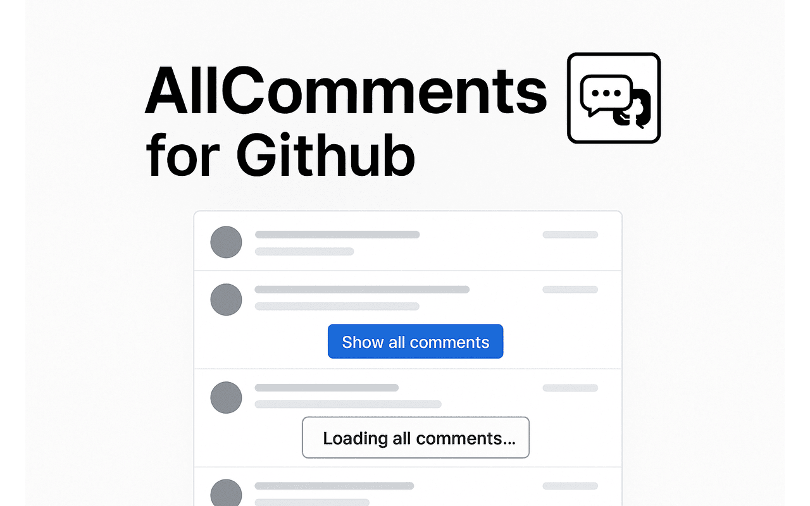

# AllComments for GitHub

Automatically expand all hidden comments on GitHub issue and pull request pages.

## 📌 What is it?

**AllComments for GitHub** is a Chrome extension that automatically clicks all "Load more" and "Show more replies" buttons on GitHub issue and pull request pages, so you can see the full conversation without needing to manually expand each thread.

Whether you're browsing a long open source thread or reviewing internal discussions on GitHub Enterprise, this tool saves time and ensures you never miss any hidden comments.

---

## ✨ Features

- ✅ Automatically expands all hidden comments on GitHub issues and pull requests
- ✅ Floating "Show all comments" button in the bottom-right corner
- ✅ Smart retry system with configurable intervals and attempt limits
- ✅ Fully customizable:
  - Allowed domains (e.g., github.com, git.company.com)
  - Reload interval and max retry attempts
  - Button label matching via regex
  - Hidden item indicator detection via regex
- ✅ Designed to run **only** on issue pages you allow (default: `github.com`)
- ✅ No external scripts, no remote code — privacy-respecting and secure

---

## ⚙️ Options

You can configure the extension by:

1. Clicking the extension icon in your browser toolbar
2. Adjusting settings like:
   - Allowed domains
   - Reload interval (500–3000ms)
   - Max attempts (1–20)
   - Regex patterns for load buttons and hidden comment indicators

> `github.com` is always enforced as a default domain and cannot be removed.

---

## 🔒 Permissions & Safety

While the extension requests `<all_urls>` host permission, it:

- Enforces domain restrictions via user-defined allowlist at runtime
- Only activates on GitHub issue and pull request pages (e.g. `/owner/repo/issues/123` or `/owner/repo/pull/456`)
- Includes strict validations and safeguards to prevent misuse
- Uses no remote code, eval, or dynamic imports

---

## 🚀 Installation

### Install from Chrome Web Store

- Install directly from the [Chrome Web Store](https://chromewebstore.google.com/detail/mnbllhcaehofjlockhjanllgedinbcga?utm_source=item-share-cb).

### Install from source (Developer Mode)

1. Download or clone this repository
2. Run `yarn build` or `npm run build`  
   2.1. (Or download the prebuilt [`extension.zip`](https://github.com/hornet1130/allcomments-for-github/releases) from the Releases page)

> **Build command guide**
>
> - `yarn build` or `npm run build`  
>   → Generates a production-ready bundle (optimized, console statements removed).
> - `yarn build:dev` or `npm run build:dev`  
>   → Generates a bundle suitable for development and debugging (no optimization/minification, console statements kept).
>
> In most cases, use `build` for installation or release, and `build:dev` during development.

3. Open `chrome://extensions` in Chrome (or a Chromium-based browser)
4. Enable **Developer mode**
5. Click **Load unpacked** and select the `dist/` folder (or unzip `extension.zip` and select its folder)

---

## 📦 Prebuilt Package

A prebuilt `extension.zip` file is included in every release so that you can install the extension without needing to build it yourself. You can find the latest version on the [Releases](https://github.com/hornet1130/allcomments-for-github/releases) page.

---

## 📄 License

[MIT](LICENSE)

---

## 🛠 Tech Stack

- Manifest v3
- Vanilla JS + TypeScript
- `esbuild` for bundling
- Chrome `storage.sync` for settings

---

## 📬 Feedback or Contributions

Feel free to submit issues or pull requests. This project is lightweight by design, but suggestions are welcome!
